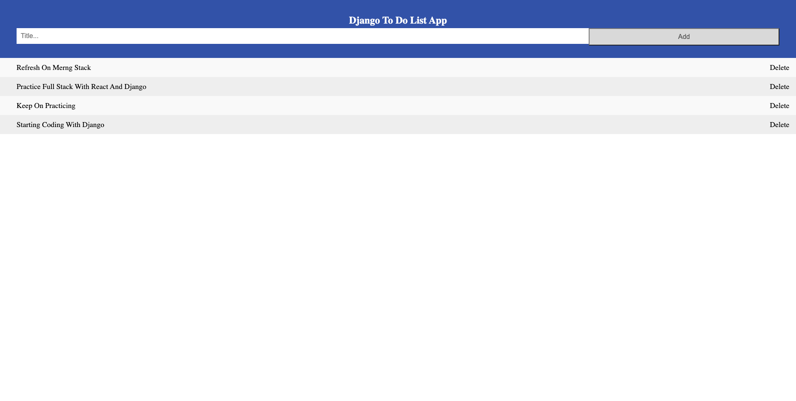

# MovieLand

## Summary

## User Story

As an avid sneaker shopper I want an easy to use website that can be saved as a PWA so that I have a more accessible way to shop
Acceptance Criteria:
Given an e-commerce platform for buying shoes
When I view the app’s store
Then I see a front end created with React
When I navigate the app
Then it is interactive and responsive
When I review the way the app determines changes to its global state
Then I find that it passes reducers to a Redux store
When I view the code for the app
Then I see the MERN stack was used
When I save the app to my home screen
Then it functions like a native app

## Tools Used

- Python
- Django
- PostgreSQL
- Heroku

# Snapshot

# Table of Contents

- [Summary](#Summary)
- [User Story](#User)
- [Tools Used](#Tools)
- [Snapshot](#Snapshot)
- [Installation & Database SetUp](#Installation)
- [Heroku](#Heroku)
- [License](#license)
- [Contributing](#contributing)
- [Tests](#tests)
- [Questions](#questions)

# Installation & Database SetUp

- To use this app npm init has to be called to create your package.json file.
- The following necessary Npm dependencies must be installed to run the application properly: the needed dependencies will be found on the package.json file.
- To properly install the database you must create at cluster on Mongodb atlas.
- Run "npm start" for the port to start listening.
- This app is deployed on Heroku

# Heroku

[Check my app here](https://todolist9993.herokuapp.com/)

# License

# Contributions

​Contributors: Juan Gomez

# Tests

N/A

# Questions?

## Please contact me:

- [My Portfolio](https://Juan-Carlos-Gomez.net)
- [My GitHub Profile](https://github.com/jcgom3)
- [My Github Project Repository](https://github.com/jcgom3/)
- [My Github Deployed IO]()
- Email me at: [Jcgom3@gmail.com](mailto:Jcgom3@gmail.com)
